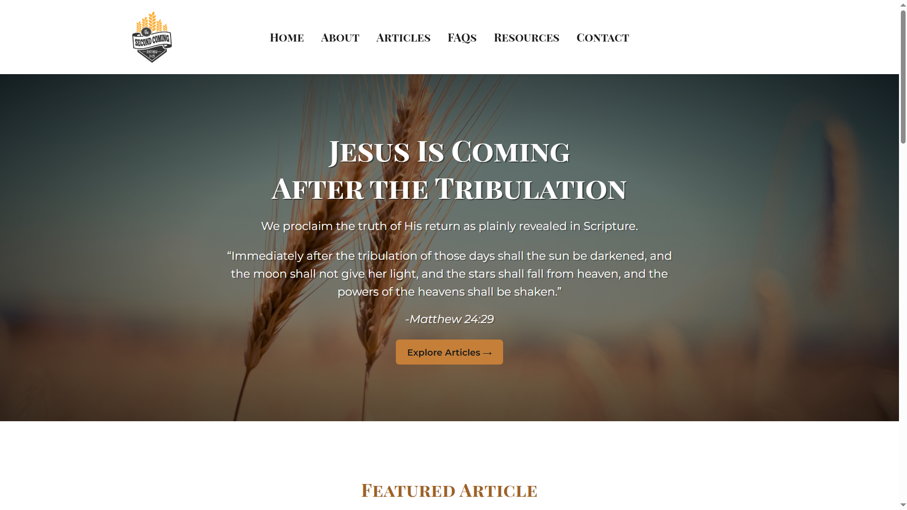

# ✝️ After the Tribulation – Theology Blog

A personal theology blog dedicated to in-depth Bible studies, 
eschatology, and Christian doctrine – all presented with clarity, 
scholarship, and love for the truth. Built using **HTML**, **CSS**, 
and **JavaScript**, this site is designed for easy reading and deep exploration.



---

## 📖 About the Project

This blog seeks to share carefully researched studies on:

- The Second Coming of Christ
- End Times prophecy (Matthew 24, Revelation, Daniel, etc.)
- The Kingdom of God
- Church doctrine and historical context

Each article is written to be both **theologically rich** and **accessible** to the modern reader.

---

## 🛠️ Tech Stack

- HTML5 & CSS3 (Responsive and semantic)
- JavaScript (for interactivity and UX)
- Google Fonts + Material Icons
- Live Server for local development
- Optimized for GitHub Pages or Netlify hosting

---

## 📁 Folder Structure

```plaintext
blog_news_template/
│
├── index.html                 # Homepage
├── about.html
├── contact.html
├── faqs.html
├── styles.css                # Main styles
├── scripts.js                # Behavior and interaction
│
├── header.html
├── footer.html
│
├── articles/                 # All article pages here
│   └── matthew24-explained.html
│   └── are-we-living-in-the-endtimes.html
│
└── images/                   # All static images
    └── wheat-harvest2.jpg
    └── 2nd-Coming-of-Jesus.png
